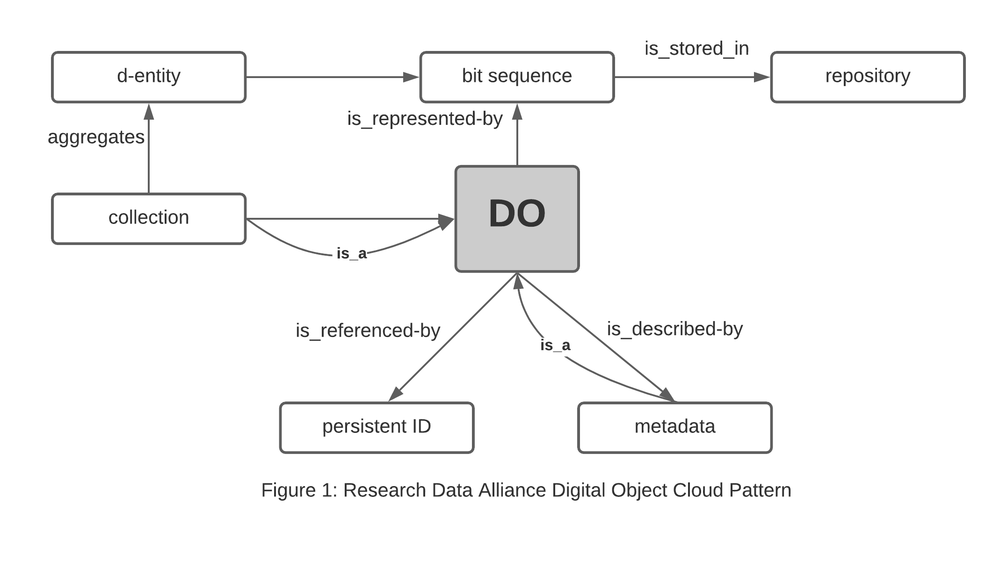

# Indexing / Harvesting

OIH employs an activity flow is entirely based on web architecture.  This means
and implementing a harvesting pattern for OIH is an application of these standards.

Once publishers are aligned with this approach any party can implement a indexing 
service through the further use of these web architecture principles.  

The current manner in which information by providers is placed on the net is 
detailed more in the [Publishing patterns for OIH](../../publishing/publishing.md)
section.

The basics are:

* resources containg JSON-LD records are identified by a sitemap by a known provider
* web based method GET access for those resources
* page content read or optionally rendered via headless browser for those cases
where client side javascript based inclusion of the JSON-LD is done
* JSON-LD is parsed from the static or rendered HTML
* The JSON-LD is leverage for generation of an index

## Tools Used in OIH

In the case of the OIH architecture the following image defines the set up.
The key initial points here are that OIH employs an object store to hold
the JSON-LD objects while they are leveraged to generate the index.

This approach has several benefits

* Facilitate easier incremental indexing to lighten the network load on
  provider systems.
* Allows multiple processing workflows on the objects without further network
traffic (validation, generation of new triples, etc).
* Provides an additional route to the data beyond the graph.  For some workflows
  such as ML or analytics an object based store has benefits.  For other tasks
  such as user interface queries, graphs tend to provide better functionality.

### Object store pattern

Within in the object store the following digital object pattern is used.  
This is based on the work of the RDA Digital Fabric working group.  

### References for key elements

[Glenaer Compose](https://github.com/gleanerio/gleaner-compose) is a 
repository for the Docker (Open Container) configurations used for the 
current OIH portal.  

[Gleaner:](https://gleaner.io) (
<https://github.com/earthcubearchitecture-project418/gleaner>) A tool
for harvesting, validating and indexing structured data on the web.

[GROW](https://github.com/fils/goobjectweb) A program that implements
the RDA Digital Object Cloud pattern on top of Amazon S3 API based
object stores. It bridges Gleaner and Mercantile to the web.

## Options

While [Gleaner](https://gleaner.io/) will be used during initial OIH development it is not
the only approach.   There are many other tools that 
can be used and might be leveraged in a production environment including:

* [LDSpider](https://github.com/ldspider/ldspider)
* [Squirrel](https://dice-group.github.io/squirrel.github.io/overview.html)
* [Nutch (Apache)](http://nutch.apache.org/)
* [Laundromat](https://github.com/LOD-Laundromat/LOD-Laundromat)
* [DataArchiver](https://github.com/websi96/datasetarchiver)
* [OD Archiver](https://archiver.ai.wu.ac.at/)

These different tools may better fit into the workflow and available skill sets for a
group.

## Indexing

At present we index into a graph store.  Note the JSON-LD is a graph and what we are
doing mostly is collecting, validating and aggregating these graph elements into a 
usable collection.  

There are various potential indexes:

* RDF graph from the collected JSON-LD (the default index goal)
* Full text index either on the metadata or potentially the associated 
  described resources if available
* Spatial index; this can also be done as part of the "graph" if using things like 
  geoSPARQL to encode and search the spatial elements.  Alternatively this could be 
  done be extracting those into a geoserver, geohash or other external spatial service
* KG completion graph where connections to external graphs are made. Only basic tesdting has been
  done on this front

## Utilization

In the end the goal is to provide use of the generated index.  There are several
possible used for an index.

* Web UI such as the reference client at [oceans.collaborium.io](oceans.collaborium.io)
  * A variation on this is the development of web components that can be easily included in 
    domain sites to perform operations on the OIH index
* graph access via SPARQL
* access to the graph and objects via workflows like Jupyter notebooks
  