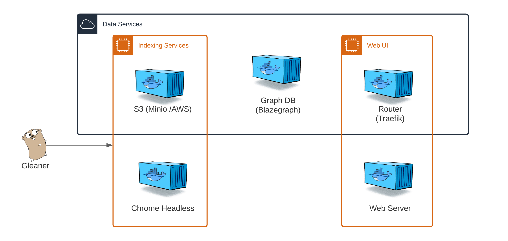

# Indexing Quick Start  



## Gleaner (app)

Gleaner the app performs the actual retrieval and loading of JSON-LD documents 
from the web.  Gleaner is available for Linux, Mac OS X and Windows.  

While Gleaner is a stand alone app, needs to interact with
an object store to support data storage.  
These dependencies can be met with the Gleaner Indexing Services or Data Service compose files.
These files are Docker compose files which allow the required services to be run. 

```{note}
This documentation is in development.  The primary testing environments are Linux and other UNIX based platforms
such as Mac OS X.   If you are on Windows, there may be some issues.  If you can use a Linux subsystem on Windows, 
you may experience better results.  We will test with Windows eventually and update documentation as needed. 
```

### Quick Start steps

```{note}
This documentation assumes a basic understanding of Docker and experience with basic Docker activities like
starting and stopping containers.  It also assumes an understanding of using a command line interface and 
editing configuration files in the YAML format. 
```

#### Grab Gleaner and the support files we need

We will need to get the Gleaner binary for your platform and also the Gleaner configuration file 
template.  To do this, visit the [Gleaner Releases page ](https://github.com/earthcubearchitecture-project418/gleaner/releases) 
and pick the release _OIH Reference 1_.  Under the _Assets_ drop down you should see the files we need.  Get:

* Gleaner for your platform
* Gleaner config template

We then need to visit [Schema.org for Developers](https://schema.org/docs/developers.html) to pull down the 
appropriate JSON-LD context.  For this work we will want to pull down the _schemaorg-current-https_ in JSON-LD format.  
It also should work to do something similar to the following:

```bash
curl -O https://schema.org/version/latest/schemaorg-current-https.jsonld
```


#### Obtain the compose file(s) you need

The above steps have collected the resources for the indexer.   We now want to set up the services that
Gleaner will use to perform the indexing.  To do that we use Docker or an appropriate run time alternative like
Podman or others.   For this example, we will assume you are using the Docker client. 

As noted, a basic understanding of docker and the ability to issue docker cli commands to start and stop
containers is required. If you are new do Docker, we recommend you visit and read: 
[Get Started with Docker](https://www.docker.com/get-started).


We need to select the type of services we wish to run.  The various versions of these Docker compose
file can be found in the [Gleaner-compose deployment directory](https://github.com/gleanerio/gleaner-compose/tree/master/deployment).

Why pick one over the other?

> Choose Gleaner IS if you simply wish to retrieve the JSON-LD into a data warehouse to use in your own workflows
> Choose Gleaner DS if you wish to build out a graph and want to use the default contains used by Gleaner.  


For this example lets select the gleaner-DS-NoRouter.yml file.

```bash
curl -O https://github.com/gleanerio/gleaner-compose/blob/master/deployment/gleaner-DS-NoRouter.yml
```


#### Edit environment variables setup script

We have Docker and the appropriate compose file.  The compose files require a set of environment variables
to be populated to privde the local hosts information needed to run.  You can set these yourself or
use or reference the setenv.sh file in the Gleaner-compose repository in the  
[Gleaner-compose deployment directory](https://github.com/gleanerio/gleaner-compose/tree/master/deployment). 

Obtain the file with:

```bash
curl -O https://raw.githubusercontent.com/gleanerio/gleaner-compose/master/deployment/setenv.sh
```

Let's take a look at this.

```{literalinclude} ./docs/setenv.sh
:linenos:
```

You may wish to edit file to work better with your environment.  By default it will attempt to
use localhost to resolve with and host local runtime data in a /tmp/gleaner directory.  

#### Spin up the containers

Load our environment variables to the shell:

```bash
./setenv.sh
```

Then start the containers:

```bash
docker-compose -f gleaner-ds.yml up -d
```

If all has gone well, you should be able to see your running containers with 

```bash
docker ps
```

and see results similar to:

```bash
stuff here
```


#### Edit Gleaner config file

We have all the files we need and we have our support services running.  The next and 
final step is to edit our Gleaner configuration file.  This will let Gleaner know 
the location of the support services, the JSON-LD context file and the locations 
of the resources we wish to index.  

Let's take a look at the configuration file and then break down each section.  

```{literalinclude} ./docs/gleaner-cfg.yml
:linenos:
```

#### Run gleaner

For this example we are going to run Gleaner directly.  In a deployed instance you may 
run Gleaner via a script or cron style service.  We will document that elsewhere.

For now, we are ready to run Gleaner.  Try:

```bash
gleaner -cfg myconfig
```

```{note}
Leave the suffix like .yaml off the name of the config file.  The config system can also read
json and other formats.  So simply leave the suffix off and let the config code inspect the 
contents. 
```


### Load results to a graph and test

You have set up the server environment and Gleaner and done your run.  Things look good
but you don't have a graph you can work with yet.    You need to load the JSON-LD into
the triplestore in order to start playing.

* Simple script loading
* Nabu
* Try out a simple SPARQL query
