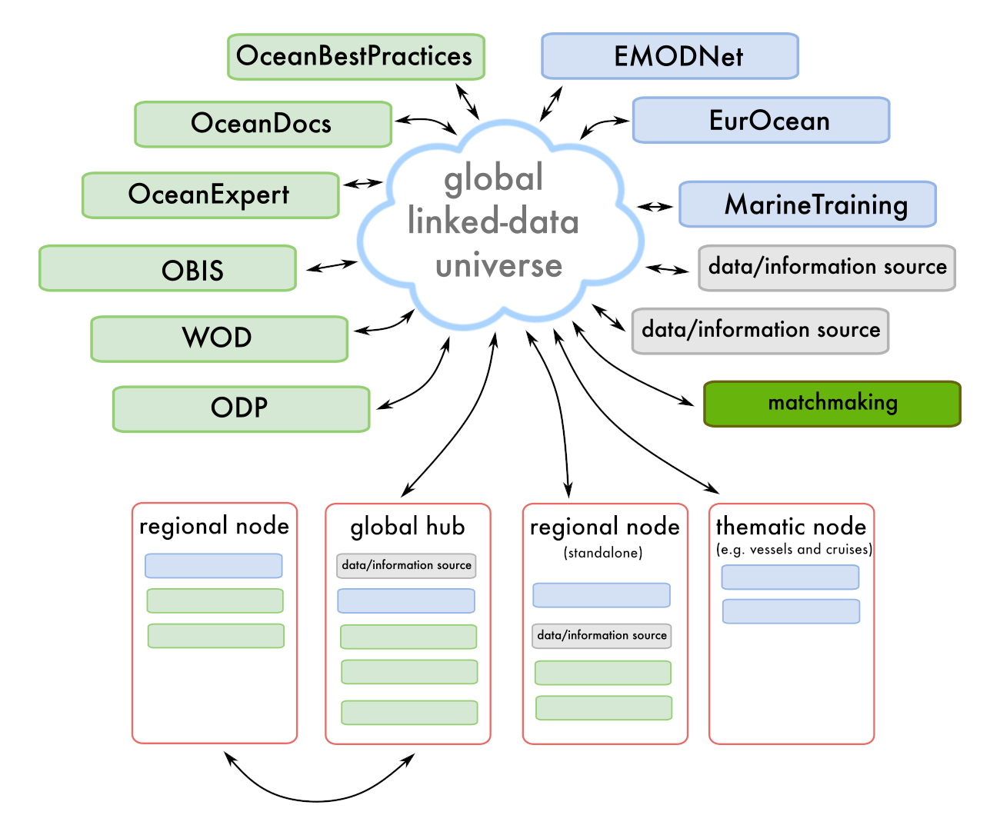

## Draft Table of Contents

- [A short introduction to the OIH project, aims and objectives and scope](#introduction)
- [A brief description of the architecture in text, as non-technical as possible](#architecture-description)
- [Technical description plus a series of links to the architecture technical content / guidelines, which would be in Github, and/or other accessible locations](#technical-description)
- [Guidelines for how to adopt / implement the ODIS-architecture (possibly domain-specific)](#guidelines)
- [Proof-of-concept: A brief introduction to the proof of concepts examples, plus links demonstrating proof of concepts; global and three regions](#proof-of-concept)

## Introduction

Vestibulum id lobortis urna. Curabitur vel aliquet dolor, in ullamcorper lacus. Fusce eget pharetra erat. Vivamus tincidunt mauris justo, ac feugiat ipsum consequat et. Etiam rhoncus consequat luctus. In non justo eu magna semper dapibus vitae sit amet magna. Nullam quis erat ultrices, elementum turpis vel, faucibus metus. Sed dapibus odio nec accumsan egestas. Quisque iaculis rhoncus metus, eget sagittis augue luctus at. Maecenas sagittis justo id massa iaculis, ut dignissim sem pharetra. Vivamus viverra ipsum est, ac gravida ante vestibulum nec.

## Architecture description

Vestibulum id lobortis urna. Curabitur vel aliquet dolor, in ullamcorper lacus. Fusce eget pharetra erat. Vivamus tincidunt mauris justo, ac feugiat ipsum consequat et. Etiam rhoncus consequat luctus. In non justo eu magna semper dapibus vitae sit amet magna. Nullam quis erat ultrices, elementum turpis vel, faucibus metus. Sed dapibus odio nec accumsan egestas. Quisque iaculis rhoncus metus, eget sagittis augue luctus at. Maecenas sagittis justo id massa iaculis, ut dignissim sem pharetra. Vivamus viverra ipsum est, ac gravida ante vestibulum nec.

## Technical description

Vestibulum id lobortis urna. Curabitur vel aliquet dolor, in ullamcorper lacus. Fusce eget pharetra erat. Vivamus tincidunt mauris justo, ac feugiat ipsum consequat et. Etiam rhoncus consequat luctus. In non justo eu magna semper dapibus vitae sit amet magna. Nullam quis erat ultrices, elementum turpis vel, faucibus metus. Sed dapibus odio nec accumsan egestas. Quisque iaculis rhoncus metus, eget sagittis augue luctus at. Maecenas sagittis justo id massa iaculis, ut dignissim sem pharetra. Vivamus viverra ipsum est, ac gravida ante vestibulum nec.

## Guidelines

Aligning to the ODIS Architecture is intended to be a non-invasive process. In essence, enriching exisitng metadata publication to include additional content complain with the ODIS Architecture profile for Schema.org in order to facilitate the discovery and access to resources.

## Proof-of-concept

In order to demonstrate the application and benefits of the ODIS Architecture, a number of technical pilots have been proposed:
*Implementation of a discovery portal at the IODE Project Office which will aggregate discovered resources having published metadata compliant with the ODIS Architecture Schema.org implementation
*Publication of metadata for relevant client web sites from selected partners
*Publication of metadata for relevant data catalogues from selected partners
*Publication of metadata for relevant standards repsositories from selected partners
*Publication of metadata for relevant training resources from selected partners

## Appendices

### List of acronyms

- IODE: International Oceanographic Data and Information Exchange
- OIH: OceanInfoHub

### Glossary

- Linked Data: In computing, linked data is structured data which is interlinked with other data so it becomes more useful through semantic queries.