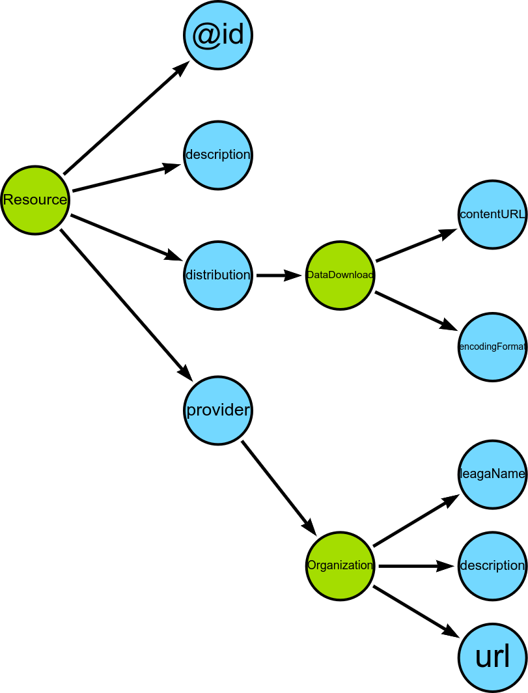

# Authoring

## About

For many groups working with JSON will already be part of the
various pipelines they have.  For others, this will be new.

This document will evolve to hold resources for people at various
levels to author with JSON-LD data graphs.

Primarily, this will be used to either create a single unique JSON-LD 
based graph for a resource or to explore an approach you might use as
a template in code.

Note, many common publishing tools already have schema.org support in 
them that leverages the package metadata data model.  We are compiling
a list of those too.

## Validation With SHACL or ShEx

Exploring options for graph validation.  

- [SHACL playground](https://shacl.org/playground/)
- [Schemarama](https://github.com/google/schemarama)
- [Schimatos.org](https://github.com/schimatos/schimatos.org)  
  - [demo](http://rsmsrv01.nci.org.au:8080/schimatos/)

### Reference

- [Comparing ShEx and SHACL](https://book.validatingrdf.com/bookHtml013.html)

## Leveraging JSON Schema

We have been exploring the potential to use JSON Schema combined with various on-line JSON editors (JSON Schema driven) to provide a potential approach to a more visual editing workflow. The workflow presented here is very ad hoc but exposes a potential route a group might take to develop a usable tool. Such a tool might, for example, leverage the Electron app dev environment to evolve this approach in a more dedicated tool/manner.

Use a JSON-LD document ([Example](./projects/graphs/sosproj.json)) one could load this into something like 
the [JSONschema.net tool](https://jsonschema.net/).

The results of the above can then been loaded into the online JSON-Editor at https://json-editor.github.io/json-editor/. (Ref: [https://github.com/json-editor/json-editor](https://github.com/json-editor/json-editor))

The results of this then can be load into https://json-ld.org/playground/ to validate that we have well formed JSON-LD.

Though this workflow is rather crude and manual it exposes a route to a defined workflow based around established schema that leverages other tools and software libraries to generate a workable tool.

## Other Tools for review

- [Lighthouse Plugins](https://github.com/GoogleChrome/lighthouse/blob/master/docs/plugins.md)
  - [Lighthouse](https://github.com/GoogleChrome/lighthouse)
- [Science on Schema](https://github.com/ESIPFed/science-on-schema.org//)
- Leadbetter's best practices
- [BioSchemas](http://bioschemas.org/)
- [CodeMeta](https://codemeta.github.io/)
- [Linter Structured Data](http://linter.structured-data.org/)
- [JSON-LD Playground](https://json-ld.org/playground/) at
    [JSON-LD.org](https://json-ld.org)
- [SHACL playground](https://shacl.org/playground/)
- [Google Structured Data testing tool](https://search.google.com/structured-data/testing-tool) (going away)
- [Google Dataset for
    developers](https://developers.google.com/search/docs/data-types/dataset)
- [Press
    article](https://www.schemaapp.com/tools/say-goodbye-to-googles-structured-data-testing-tool-and-hello-to-the-alternatives/)
- [Rich results](https://search.google.com/test/rich-results)
- [SchemaApp.com](https://www.schemaapp.com/solutions/structured-data-health-check-diagnostic/)
- [Yandex](https://webmaster.yandex.com/tools/microtest/)
- [Schema dev](https://test.schema.dev/)
- [Chrome
    extension](https://chrome.google.com/webstore/detail/ryte-structured-data-help/ndodccbbcdpcmabmiocobdnfiaaimgnk?hl=en)
- [Google Rich Results](https://search.google.com/test/rich-results)
- [Datashapes](http://datashapes.org/)

## References

* https://code.visualstudio.com/docs/languages/json
* https://www.schemastore.org/json/
* https://stedolan.github.io/jq/
* https://github.com/tomnomnom/gron

