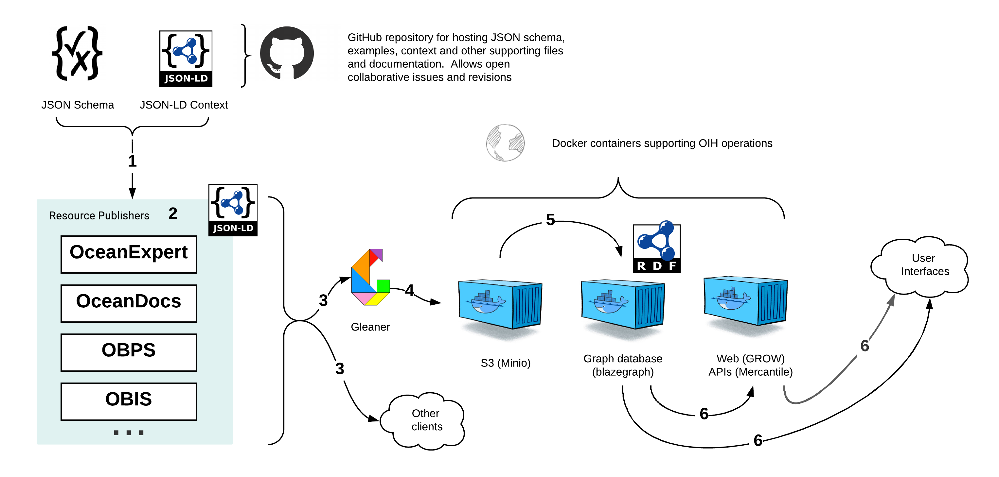

# Background

## NOTE

Much of this information will be moved to the more specific
[authoring](authoring.md) and [publishing](publishing.md)
documents. This document will be turning into more of a
a description of the OIH test implementation. 
## Overview

The architecture defines a workflow for objects, a \"digital object
chain\". Here, the digital object (DO) is the data graph such as the
JSON-LD package in a landing page.

The chain is the life cycle connecting; authoring, publishing,
aggregation, indexing and searching/interfaces.

### Stack

The following image shows a general overview of the architecture.

### Flow

1. Providers are engaged to provide structured data on the web and
    provide robots.txt and sitemap.xml entries to facilitate indexing.
2. Harvesting will be done using the Gleaner package developed as part
    of NSF\'s EarthCube Project 418/419. Harvesting is simply a further
    leveraging of the web architecture approach and it is expected that
    other harvesters with perhaps community or interface specific goals
    will develop.
3. The results of the Gleaner harvest (data graphs, reports,
    validations and generated indexes) are stored in an S3 compliant
    object store.
4. Generated graph is loaded into a triplestore (Blazegraph in this
    case) for query and analysis. Future options include leveraging the
    approach for spatial or other indexes.
5. From there interfaces can be built such as simple web interfaces,
    GraphQL or other interface options. Spatial, full text or other
    indexes can be built. It\'s also possible to explore connections to
    other research graphs such as the Freya Project or others.

------------------------------------------------------------------------

## P418

[Science on Schema:](https://github.com/ESIPFed/science-on-schema.org/)
Community guidance on best practices for employing schema.org for
geoscience datasets

[Gleaner](https://gleaner.io/)

New EarthCube Office work: [GeoDex](https://geodex.org/) and [Object
Exchange page
DEMO](https://dx.geodex.org/?o=/iris/107b0c662fa9051d3714b0e93fef981713d2ca48.jsonld)
This demo is driven by web components.

Lessons learned

- Graphs are generally ugly due to the organic nature of them. Ugly
    graphs are harder to query, parse and display.
- If we make it easy for publishers in their space -\> becomes hard in
    query space
- PIDS are important as are explicate IDs in the data graph.
- Death by http! The http https impedance is becoming, and will
    become, more and more an issue in a federated or distributed model.

[JSON-LD structure and https
testing](https://github.com/fils/JSON-LD_inspection) Worried about
http/https impedance to the digital object cloud for JSON-LD and
schema.org. Doing some exploring.
:::

------------------------------------------------------------------------

## Tooling

------------------------------------------------------------------------

This material moved to [indexers](./indexers.md)

### Authoring

------------------------------------------------------------------------

This material moved to [authoring](authoring.md)

### Publishing

------------------------------------------------------------------------

This material moved to [publishing](./publishing.md)

### Harvesting

------------------------------------------------------------------------

This material moved to [indexers](./indexers.md)

