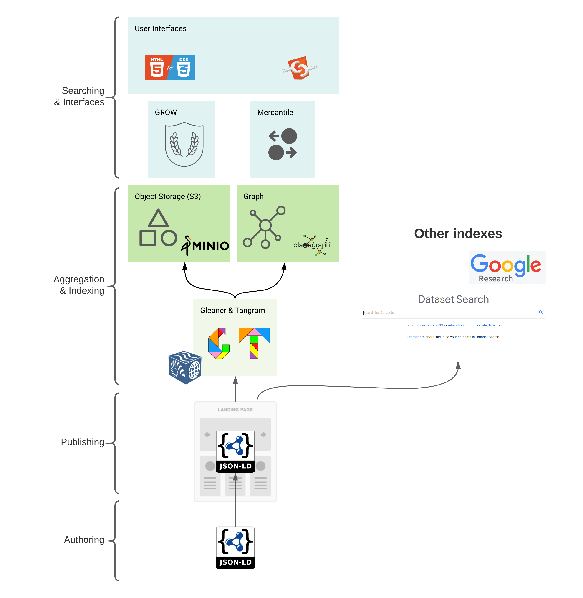
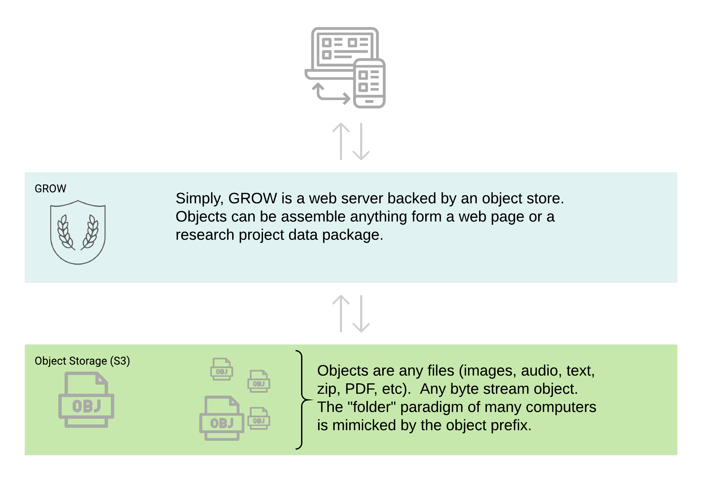

# Background

## Overview

The architecture defines a workflow for objects, a \"digital object
chain\". Here, the digital object (DO) is the data graph such as the
JSON-LD package in a landing page.

The chain is the life cycle connecting; authoring, publishing,
aggregation, indexing and searching/interfaces.

### Stack

The following image shows a general overview of the architecture.

### Flow

1. Providers are engaged to provide structured data on the web and
    provide robots.txt and sitemap.xml entries to facilitate indexing.
2. Harvesting will be done using the Gleaner package developed as part
    of NSF\'s EarthCube Project 418/419. Harvesting is simply a further
    leveraging of the web architecture approach and it is expected that
    other harvesters with perhaps community or interface specific goals
    will develop.
3. The results of the Gleaner harvest (data graphs, reports,
    validations and generated indexes) are stored in an S3 compliant
    object store.
4. Generated graph is loaded into a triplestore (Blazegraph in this
    case) for query and analysis. Future options include leveraging the
    approach for spatial or other indexes.
5. From there interfaces can be built such as simple web interfaces,
    GraphQL or other interface options. Spatial, full text or other
    indexes can be built. It\'s also possible to explore connections to
    other research graphs such as the Freya Project or others.

------------------------------------------------------------------------

## P418

[Science on Schema:](https://github.com/ESIPFed/science-on-schema.org/)
Community guidance on best practices for employing schema.org for
geoscience datasets

[Gleaner](https://gleaner.io/)

New EarthCube Office work: [GeoDex](https://geodex.org/) and [Object
Exchange page
DEMO](https://dx.geodex.org/?o=/iris/107b0c662fa9051d3714b0e93fef981713d2ca48.jsonld)
This demo is driven by web components.

Lessons learned

- Graphs are generally ugly due to the organic nature of them. Ugly
    graphs are harder to query, parse and display.
- If we make it easy for publishers in their space -\> becomes hard in
    query space
- PIDS are important as are explicate IDs in the data graph.
- Death by http! The http https impedance is becoming, and will
    become, more and more an issue in a federated or distributed model.

[JSON-LD structure and https
testing](https://github.com/fils/JSON-LD_inspection) Worried about
http/https impedance to the digital object cloud for JSON-LD and
schema.org. Doing some exploring.
:::

------------------------------------------------------------------------

## Tooling

[Gleaner:](https://gleaner.io) (
<https://github.com/earthcubearchitecture-project418/gleaner>) A tool
for harvesting, validating and indexing structured data on the web.

[Fence:](Fence%20https://github.com/earthcubearchitecture-project418/fence)
A testing environment leveraging SHACL, sitemaps and JSON-LD framing
approaches in support of Gleaner development.

[Tangram](https://github.com/earthcubearchitecture-project418/tangram) A
service wrapper around PySHACL to allow web based SHACL validation of
data graphs.

[GROW](https://github.com/fils/goobjectweb) A program that implements
the RDA Digital Object Cloud pattern on top of Amazon S3 API based
object stores. It bridges Gleaner and Mercantile to the web.

[Mercantile](https://github.com/earthcubearchitecture-project418/mercantile)
A GraphQL server that connects to graph databases. It fronts SPARQL
calls to a data interface defined from the schema.org type Dataset
\"class\" (ref: https://schema.org/Dataset) or other JSON-LD schema.

Other Tools for review:

- [JSON-LD Playground](https://json-ld.org/playground/) at
    [JSON-LD.org](https://json-ld.org)
- [SHACL playground](https://shacl.org/playground/)
- [Google Structured Data testing
    tool](https://search.google.com/structured-data/testing-tool) (going
    away)
- [Google Dataset for
    developers](https://developers.google.com/search/docs/data-types/dataset)
- [Press
    article](https://www.schemaapp.com/tools/say-goodbye-to-googles-structured-data-testing-tool-and-hello-to-the-alternatives/)
- [Rich results](https://search.google.com/test/rich-results)
- [SchemaApp.com](https://www.schemaapp.com/solutions/structured-data-health-check-diagnostic/)
- [Linter Structured Data](http://linter.structured-data.org/)
- [Yandex](https://webmaster.yandex.com/tools/microtest/)
- [Schema dev](https://test.schema.dev/)
- [Chrome
    extension](https://chrome.google.com/webstore/detail/ryte-structured-data-help/ndodccbbcdpcmabmiocobdnfiaaimgnk?hl=en)
- [Google Rich Results](https://search.google.com/test/rich-results)
- [Datashapes](http://datashapes.org/)

------------------------------------------------------------------------

## Next Steps

- Focus on schema.org, lay groundwork for connection to other
    vocabularies
- Focus on the platform (based on web architecture) not any package or
    implementation

[ODIS Arch Fork](https://github.com/fils/odis-arch) [(My
notes)](https://github.com/fils/odis-arch/blob/master/docs/dev/thoughts.md)

### Authoring

------------------------------------------------------------------------

JSON-LD (as serialization)

schema.org (voc)

- others can be used
- development of guidance
- validation (SHACL?)
- Alignment to other best practices approaches

Validation (SHACL, JSON schema, other?). Validation would address PID elements as well as implementation patterns for funding and other elements

Exploration ideas include: 

- [Schimatos.org](https://github.com/schimatos/schimatos.org)  
  - [demo](http://rsmsrv01.nci.org.au:8080/schimatos/)
- [Schemarama](https://github.com/google/schemarama)

### Publishing

------------------------------------------------------------------------

Leverage robots.txt for both crawling info and agent routes

Leverage [sitemaps](https://www.sitemaps.org/) with lastmod date node

HTML pages with JSON-LD with either static or dynamic payload injection. Note DataCite JS for dynamic loading of DOI metadata as JSON-LD

Reviewing plugins or approach for platforms in use: 

- [Drupal](https://www.drupal.org/docs/contributed-modules/schemaorg-metatag)
- [CKAN](https://ckan.org/2018/04/30/make-open-data-discoverable-for-search-engines/)
- [DSpace](https://journal.code4lib.org/articles/13191)
- [ERDDAP (native support)](https://www.ncei.noaa.gov/erddap/index.html)
- [OPeNDAP (native support)](https://www.opendap.org/)

### Harvesting

------------------------------------------------------------------------

[Gleaner](https://gleaner.io/) will be used as it was developed by the contractor.  However, that is more
due to it's highly adaptable and hackable nature.  There are many other tools that 
can be used and might be leveraged in a production environment including:

- [LDSpider](https://github.com/ldspider/ldspider)
- [Squirrel](https://dice-group.github.io/squirrel.github.io/overview.html)
- [Nutch (Apache)](http://nutch.apache.org/)
- [Laundromat](https://github.com/LOD-Laundromat/LOD-Laundromat)

Work on notebooks and other tools for testing by participants. [Example](https://colab.research.google.com/drive/18RVRtgWxNtVoYug09OO4qtWVimVCTuFU?usp=sharing)

### Indexing

------------------------------------------------------------------------

RDF graph from the collected JSON-LD (part of Gleaner default output)

Full text index (for now via Lucene in Blaze. Perhaps later link in Elastic)

Spatial index (and exchange formats). We have workable pipelines for this in Gleaner, however the graphs typically don't provide spatial in a format easy to work with here. The results are spotty.

Connections to external graphs. Nothing done on this front, but would be great to see. Results as nanopubs to integrate. (Gleaner does basic nanopub prov now)

Index the data (not the metadata) via tika pipeline. Not planned as part of this work, but was done in P418, could be leveraged if a group had interest. Likely something to do local to a data provider and expose as a generated graph.

### Utilization

------------------------------------------------------------------------

Searching the indexes (Mercantile)

Data access via the results (links to distribution nodes)

Notebooks to search and then access the data or mine the metadata objects at the hub.

Web components to enables inclusion at partner domains.

